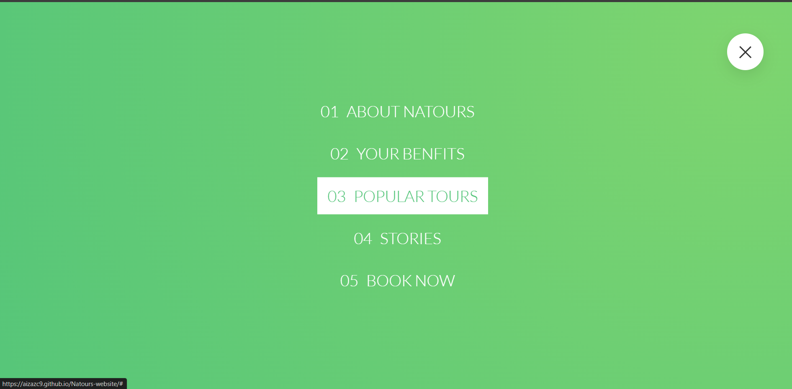
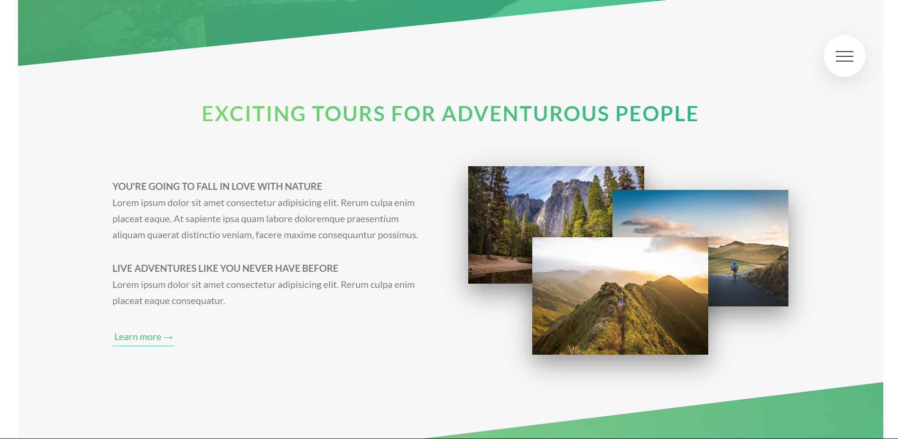
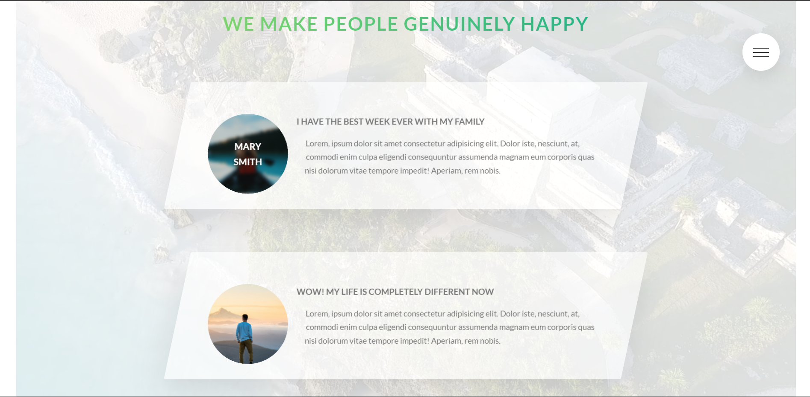
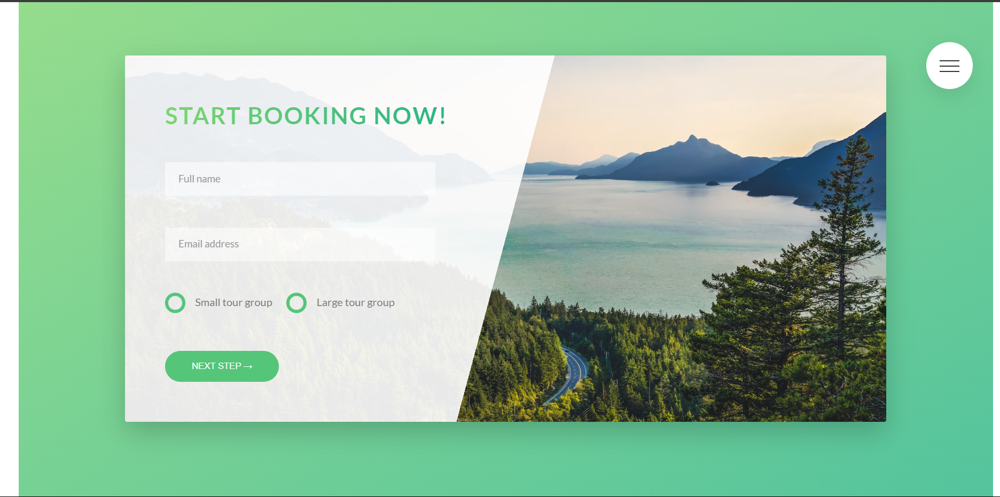
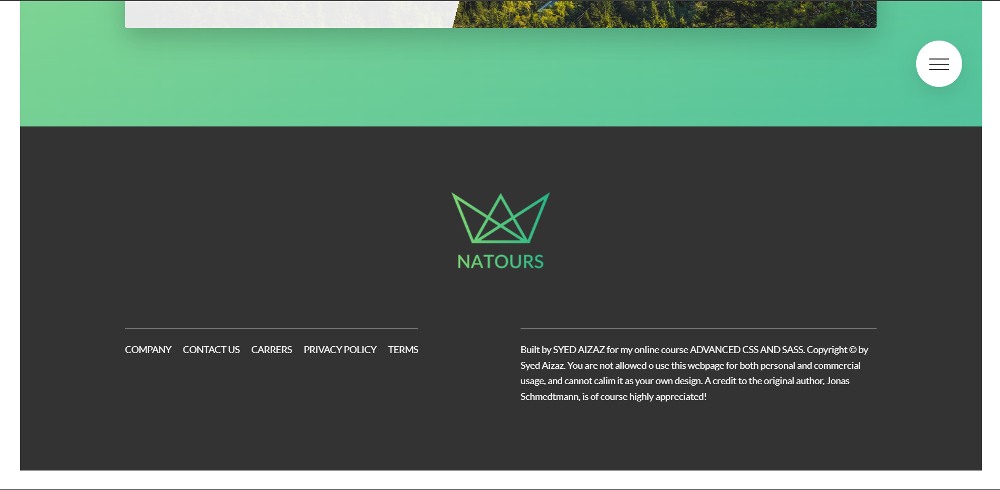

# Trip Booking Website Frontend

Welcome to the Trip Booking Website Frontend repository! This project aims to provide a user-friendly interface for booking trips, where users can explore various trip details and make bookings effortlessly.

## Overview

This frontend application is built using modern web development technologies such as HTML, CSS, and JavaScript. It offers a visually appealing and intuitive interface for users to browse available trips, view trip details, and complete the booking process seamlessly.

## Features

- **Browse Trips:** Users can explore a wide range of available trips, each with detailed descriptions, pricing information, and images.
- **View Trip Details:** Detailed trip information, including itinerary, accommodations, and activities, is presented in a clear and organized manner.
- **Book Trips:** Users can easily book their preferred trips directly through the website, with a simple and intuitive booking process.
- **Responsive Design:** The frontend is designed to be responsive, ensuring optimal user experience across various devices and screen sizes.

## Screenshots

Below are some screenshots showcasing the user interface of the Trip Booking Website:

*Figure 1: Homepage displaying featured trips*

*Figure 2: Navigation features*

*Figure 3: Benefits of the trip*

*Figure 4: Trip details page with itinerary and pricing information*

*Figure 5: General information about places and their images*

*Figure 6: People stories about their experience on the trip*

*Figure 7: Booking process with user details and payment options*

*Figure 8: Information of website and links of different social links*

## Contributing

Contributions to improve the Trip Booking Website frontend are welcome! Feel free to submit pull requests or open issues for any suggestions or improvements.

## License

This project is licensed under the [AizazC9](LICENSE).
